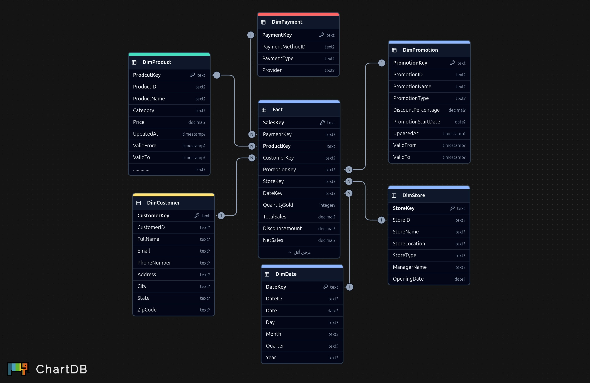
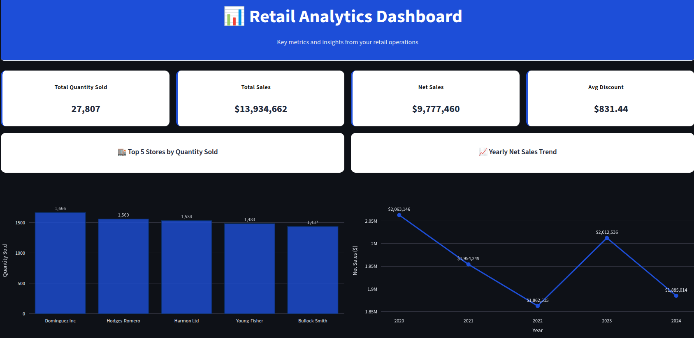
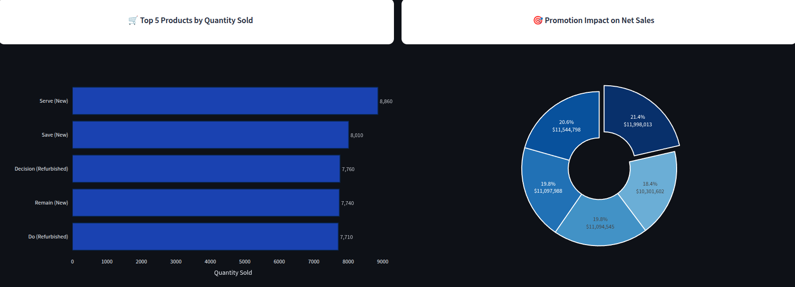

# Retail-Data-Pipeline-EndToEnd

This project demonstrates an end-to-end retail data pipeline that processes, transforms, and visualizes retail data. It ingests raw data, processes it using Apache Airflow and DBT, stores it in PostgreSQL, and visualizes insights using a Streamlit dashboard. The pipeline handles data related to customers, stores, orders, payments, promotions, and products, enabling retail analytics such as sales trends, top-performing stores, and promotion impacts.


## Table of Contents
- [Tech Stack](#Tech-Stack)
- [Architecture](#Architecture)
- [Directories](#Important-Directories)
- [Setup Instructions](#Setup-Instructions)
- [Steps to Run](#Steps-to-Run)
- [Results](#Results)
 

---

## Tech-Stack

- **Apache Airflow**: A workflow orchestration tool used to schedule and manage data pipeline tasks.
- **DBT (Data Build Tool)**: Transforms raw data into a structured star schema for analytics.
- **PostgreSQL**: A relational database used for storing structured data.
- **Docker & Docker Compose**: Containerization tools for deploying.

---


## Architecture

### Data Ingestion
1. Synthetic retail data **(customers, stores, orders, payments, promotions, products)** is generated using a Python script.
2. **Apache Airflow** orchestrates the ingestion and processing of data.

### Data Transformation
1. **DBT** transforms raw CSV data into dimension tables **(DimCustomer, DimProduct, DimStore, DimPayment, DimPromotion, DimDate) and a fact table (FactSales)**.
2. Incremental updates and slowly changing dimensions are handled using DBT snapshots.


### Data Storage
1. Transformed data is stored in a **PostgreSQL** database.



### Visualization
1. A Streamlit dashboard provides interactive visualizations of key metrics, sales trends, top stores, top products, and promotion impacts.


## Important Directories and Files

- **`generate_fake_data.py`**: Script for generating synthetic retail data. 
- **`streamlit_app.py`**:  Streamlit app for visualization. 
- **`dags/`**: Directory for Apache Airflow DAGs.
- **`retail_dbt/`**: Contains DBT models for data transformation.
- **`docker-compose.override.yml`**: Docker Compose file.  


## Setup-Instructions

- Ensure Python 3.8+, PostgreSQL, Docker,and Astro are installed.


## Steps-to-Run

1. **Clone the Repository**:
   ```bash
   git clone https://github.com/Salah-Mahmoud/Retail-Data-Pipeline-EndToEnd.git
   cd Retail-Data-Pipeline-EndToEnd
   ```
2. **Run Astro**:
   ```bash
   astro dev start
   ```
3. **Run Data Generation Script**:
   ```bash
   python generate_fake_data.py

   ```
4. **Trigger the Airflow DAG using the UI**

5. **Run the Streamlit Dashboard**:
   ```bash
   streamlit run streamlit_app.py --server.port 8501
   ```
      ```


## Results

- **Streamlit Dashboard:**




